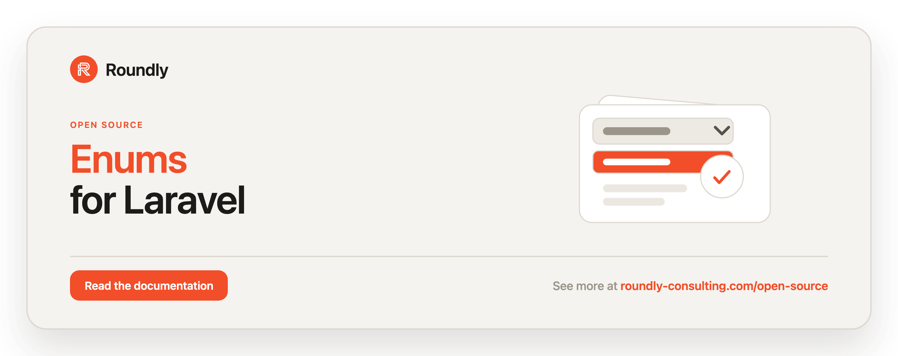

<!-- roundly-hero:start -->
<p align="center">
  <a href="https://roundly-consulting.com/open-source/docs/enums-for-laravel?utm_source=github&utm_medium=readme&utm_campaign=open-source&utm_content=enums-for-laravel">
    
  </a>
</p>
<!-- roundly-hero:end -->

<!-- roundly-badges:start -->
<p align="center">
  <a href="https://packagist.org/packages/roundly-consulting/enums-for-laravel"></a>
  <a href="https://github.com/roundly-consulting/enums-for-laravel/actions/workflows/run-tests.yml"></a>
  <a href="https://github.com/roundly-consulting/enums-for-laravel/actions/workflows/fix-php-code-style-issues.yml"></a>
  <a href="https://donate.stripe.com/dRmeVe8FX5PF1Qd9pXcEw00"></a>
  <a href="https://www.patreon.com/cw/roundly"></a>
  <a href="https://roundly-consulting.com/support-us?utm_source=github&utm_medium=readme&utm_campaign=open-source&utm_content=enums-for-laravel#crypto"></a>
</p>
<!-- roundly-badges:end -->

# Enums for Laravel

Convenient helper methods for PHP enums in Laravel applications.

Drop the `Helpers` trait into any enum to get readable labels, names/values/labels
accessors, case lookups, select-ready option lists, a ready-made validation rule,
random selection, expressive equality checks, and fluent conditional callbacks — all
backed by Laravel's `Str` helpers and translator.

Backed (string/int) enums get the full surface. Pure (non-backed) enums work too: any
method that would read a backing value — `values()`, `storable()`, `hasValue()`,
`validationRule()`, `toOptions()`, `options()`, `readable()` — uses the case `name` instead.

## Requirements

- PHP `^8.4`
- A Laravel `^12.0` or `^13.0` application. The package itself only requires
  `illuminate/contracts`, `illuminate/container` and `illuminate/support`; labels are
  translated through the application's `translator`, so label-producing methods need a
  booted app.

## Installation

Install the package via Composer:

```bash
composer require roundly-consulting/enums-for-laravel
```

There is nothing to publish or migrate — this is a trait-only package with no service
provider, config, or migrations. There is no facade either: the helpers live on your own
enums, so there is no stateful API to route through one.

## Usage

Add the `RoundlyConsulting\Enums\Helpers` trait to any enum. Backed enums get every
method; pure enums fall back to the case name where a value would be used:

```php
use RoundlyConsulting\Enums\Helpers;

enum NewsCategory: string
{
    use Helpers;

    case HotNews = 'hot-news';
    case RegularNews = 'regular-news';
    case PrivateNews = 'private-news';
}
```

### Readable labels

`readable()` turns a case into a human-friendly, translated label using `Str::headline()`.
The headline is looked up in Laravel's translator (current locale), so you can localise
labels via your translation files — for example `lang/sk.json` with
`{"Hot News": "Horúce správy"}`. Without a matching translation the headline itself is
returned. `label()` is an alias of `readable()`.

```php
NewsCategory::HotNews->readable(); // "Hot News"
NewsCategory::HotNews->label();    // "Hot News"
```

For a pure enum, `readable()` headlines the case name instead of a backing value:

```php
enum Status { use Helpers; case Active; }

Status::Active->readable(); // "Active"
```

### Names, values and labels

Get every case's name, backed value, or readable label as an
`Illuminate\Support\Collection` in declaration order (call `->all()` for a plain array).

```php
NewsCategory::names()->all();   // ['HotNews', 'RegularNews', 'PrivateNews']
NewsCategory::values()->all();  // ['hot-news', 'regular-news', 'private-news']
NewsCategory::labels()->all();  // ['Hot News', 'Regular News', 'Private News']
```

`storable()` is the persistence-flavoured alias of `values()` — both return the raw
backed values, handy for validation rules or persisting an allowed set.

```php
NewsCategory::storable()->all(); // ['hot-news', 'regular-news', 'private-news']
```

For a pure enum, the values are the case names:

```php
Status::values()->all(); // ['Active']
```

`collect()` returns every case as a collection of enum instances, and `count()` is the
number of cases.

```php
NewsCategory::collect(); // Collection<NewsCategory>
NewsCategory::count();   // 3
```

### Select options

`toOptions()` returns a `value => label` collection, ready for a `<select>` element or a
form component, and `toArray()` is its plain-array form for JSON and API responses.

```php
NewsCategory::toOptions(); // Collection: 'hot-news' => 'Hot News', ...

NewsCategory::toArray();
// ['hot-news' => 'Hot News', 'regular-news' => 'Regular News', 'private-news' => 'Private News']
```

Labels are translated, so build options at runtime (controllers, views, resources), not
inside a `config/*.php` file: config loads before the translator exists, and a cached
config would freeze the labels in one locale. A config file can hold the translation-free
`NewsCategory::values()->all()` instead.

`options()` returns a list of typed `EnumOption` DTOs (`value`, `label`, `name`) — the
shape JS/Inertia/React/Vue selects expect:

```php
NewsCategory::options();
// Collection<EnumOption{ value: 'hot-news', label: 'Hot News', name: 'HotNews' }, ...>

NewsCategory::options()->first()->toArray();
// ['value' => 'hot-news', 'label' => 'Hot News', 'name' => 'HotNews']
```

### Case lookups

Resolve a case from a `name`, a readable `label`, and check existence. The `from*`
variants throw a `RoundlyConsulting\Enums\Exceptions\EnumException` when no case matches;
the `tryFrom*` variants return `null` (and short-circuit on a `null` argument).

```php
NewsCategory::fromName('HotNews');       // NewsCategory::HotNews
NewsCategory::tryFromName('Missing');    // null
NewsCategory::tryFromName(null);         // null

NewsCategory::fromLabel('Hot News');     // NewsCategory::HotNews
NewsCategory::tryFromLabel('Nope');      // null

NewsCategory::hasName('HotNews');        // true
NewsCategory::hasValue('hot-news');      // true (strict: '5' never matches an int-backed 5)
```

### Validation

`validationRule()` builds a Laravel `in:...` rule string from `values()` (the case names
for a pure enum), so the allow-list never drifts when cases change.

```php
$request->validate([
    'category' => ['required', NewsCategory::validationRule()],
]);
// validationRule() === 'in:hot-news,regular-news,private-news'
```

A value that would break the rule's comma-separated syntax — one containing a comma or
starting with a double quote — is quoted (e.g. `'in:"a,b",c'`), so it validates exactly.
Pass the rule as an array element, as above, rather than inside a `|`-delimited string.

### Random selection

`random()` returns a random case — handy for factories, seeders, and tests.

```php
NewsCategory::random(); // a random NewsCategory case
```

### Equality checks

```php
$category = NewsCategory::HotNews;

$category->is(NewsCategory::HotNews);    // true
$category->isNot(NewsCategory::HotNews); // false

$category->isIn([NewsCategory::HotNews, NewsCategory::RegularNews]);    // true
$category->isNotIn([NewsCategory::RegularNews, NewsCategory::PrivateNews]); // true
```

### Conditional callbacks

The `whenIs*` methods run a callback only when the condition matches, with an optional
default callback otherwise. Each returns the enum instance, so calls remain fluent.

```php
NewsCategory::HotNews
    ->whenIs(NewsCategory::HotNews, fn ($enum) => activate($enum))
    ->whenIsNot(NewsCategory::PrivateNews, fn ($enum) => publish($enum));

NewsCategory::HotNews->whenIsIn(
    [NewsCategory::HotNews, NewsCategory::RegularNews],
    fn ($enum) => notifySubscribers($enum),
    fn ($enum) => archive($enum), // runs when the condition is false
);

NewsCategory::HotNews->whenIsNotIn(
    [NewsCategory::PrivateNews],
    fn ($enum) => index($enum),
);
```

## Testing

```bash
composer test
```

## Changelog

Please see [CHANGELOG](CHANGELOG.md) for more information on what has changed recently.

<!-- roundly-support:start -->
## Support our work

This package is free and open source, built and maintained by
[Roundly Consulting](https://roundly-consulting.com/open-source?utm_source=github&utm_medium=readme&utm_campaign=open-source&utm_content=enums-for-laravel).
If it saves you time, please consider supporting our open-source work — a one-time donation, a
monthly pledge on Patreon or a crypto donation helps fund maintenance, new features and new
packages.

<a href="https://donate.stripe.com/dRmeVe8FX5PF1Qd9pXcEw00"></a>
<a href="https://www.patreon.com/cw/roundly"></a>
<a href="https://roundly-consulting.com/support-us?utm_source=github&utm_medium=readme&utm_campaign=open-source&utm_content=enums-for-laravel#crypto"></a>
<!-- roundly-support:end -->

## License

The MIT License (MIT). Please see [LICENSE](LICENSE.md) for more information.
